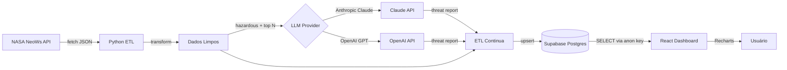

# Planetary Defense System

> Pipeline de dados de ponta a ponta que extrai asteroides próximos da Terra da API da NASA, enriquece com IA Generativa e os exibe em um dashboard sci-fi em tempo real.

[](#licença)
[](https://www.python.org/)
[](https://nodejs.org/)
[](https://react.dev/)
[](https://www.typescriptlang.org/)
[](https://supabase.com/)
[](https://tailwindcss.com/)

---

## Sumário

- [Sobre o Projeto](#sobre-o-projeto)
- [Demonstração](#demonstração)
- [Funcionalidades](#funcionalidades)
- [Arquitetura](#arquitetura)
- [Stack Tecnológica](#stack-tecnológica)
- [Estrutura do Projeto](#estrutura-do-projeto)
- [Pré-requisitos](#pré-requisitos)
- [Setup Passo a Passo](#setup-passo-a-passo)
  - [Fase 1: Banco de Dados (Supabase)](#fase-1-banco-de-dados-supabase)
  - [Fase 2: Pipeline ETL (Python)](#fase-2-pipeline-etl-python)
  - [Fase 3: Dashboard (React)](#fase-3-dashboard-react)
- [Configuração do LLM](#configuração-do-llm)
- [Variáveis de Ambiente](#variáveis-de-ambiente)
- [Como o Pipeline Funciona](#como-o-pipeline-funciona)
- [Automatizando a Execução](#automatizando-a-execução)
- [Design System](#design-system)
- [Roadmap](#roadmap)
- [Contribuindo](#contribuindo)
- [Licença](#licença)
- [Agradecimentos](#agradecimentos)

---

## Sobre o Projeto

O **Planetary Defense System** é um projeto open-source educacional que demonstra um pipeline de dados moderno completo:

1. **Extração** de dados de asteroides próximos à Terra (NEOs — *Near-Earth Objects*) diretamente da [API pública da NASA](https://api.nasa.gov/).
2. **Transformação e limpeza** dos dados em Python.
3. **Enriquecimento com IA Generativa** — para cada asteroide perigoso, um LLM (Anthropic Claude ou OpenAI GPT) gera um "Relatório de Ameaça" em tom sarcástico.
4. **Persistência** no Supabase (PostgreSQL gerenciado).
5. **Visualização** em um dashboard React com tema sci-fi dark, gráfico de dispersão e painel de ameaças.

É um excelente material para estudar **engenharia de dados**, **integração com APIs públicas**, **uso prático de LLMs em pipelines** e **frontend moderno com TypeScript**.

---

## Demonstração

> Adicione aqui prints da sua execução — sugestão de locais:
>
> - `docs/screenshots/dashboard.png` — visão geral do dashboard
> - `docs/screenshots/scatter.png` — gráfico de dispersão
> - `docs/screenshots/threats.png` — painel de ameaças com relatórios de IA

```
+--------------------------------------------------+
|  PLANETARY DEFENSE SYSTEM           Link Online  |
|  Near-Earth Object Monitoring                    |
+--------------------------------------------------+
|  [ 12 ]  [ 845.3m ]  [ 92.418 km/h ]  [ 2 ]      |
|  Total    Maior        Mais Rápido    Ameaças    |
+--------------------------------------------------+
|                                                  |
|       Mapa de Trajetórias (Scatter Chart)        |
|                                                  |
+--------------------------------------------------+
|  Painel de Ameaças                               |
|  > Asteroide 2024 BC ...                         |
|    "A NASA diz que está tudo bem, mas..."        |
+--------------------------------------------------+
```

---

## Funcionalidades

- **ETL idempotente** — pode rodar várias vezes ao dia sem duplicar dados (`upsert` em `nasa_neo_reference_id`).
- **Suporte multi-LLM** — alterne entre Anthropic e OpenAI apenas mudando uma variável de ambiente.
- **Resiliente a falhas** — uma chamada de LLM com erro não derruba o pipeline; o asteroide é salvo sem relatório.
- **Dashboard responsivo** — funciona bem em desktop, tablet e mobile.
- **Tipado de ponta a ponta** — Python com `TypedDict` e type hints, frontend 100% TypeScript.
- **RLS configurado** — leitura pública via `anon`, escrita restrita à `service_role`.
- **Dark mode sci-fi** — paleta neon, fontes monoespaçadas, efeitos de glow sutis.

---

## Arquitetura



### Camadas

| Camada | Responsabilidade | Tecnologia |
|---|---|---|
| **Extração** | Buscar dados de NEOs do dia atual | Python + `requests` |
| **Transformação** | Limpar, tipar e normalizar | Python + `TypedDict` |
| **Enriquecimento IA** | Gerar relatórios sarcásticos | Anthropic / OpenAI SDK |
| **Persistência** | Armazenar e versionar | Supabase (Postgres) |
| **Apresentação** | Visualizar e explorar | React + Vite + TS |

---

## Stack Tecnológica

### Backend / ETL
- **Python 3.10+**
- [`requests`](https://requests.readthedocs.io/) — HTTP client
- [`supabase-py`](https://github.com/supabase-community/supabase-py) — client Postgres
- [`anthropic`](https://github.com/anthropics/anthropic-sdk-python) — Claude SDK
- [`openai`](https://github.com/openai/openai-python) — OpenAI SDK
- [`python-dotenv`](https://github.com/theskumar/python-dotenv) — env management

### Frontend
- **React 18** + **TypeScript 5**
- [**Vite**](https://vitejs.dev/) — bundler ultrarrápido
- [**Tailwind CSS 3**](https://tailwindcss.com/) — utility-first CSS
- [**Recharts**](https://recharts.org/) — gráficos declarativos
- [**Lucide React**](https://lucide.dev/) — ícones
- [`@supabase/supabase-js`](https://github.com/supabase/supabase-js) — client realtime

### Infra
- [**Supabase**](https://supabase.com/) — Postgres gerenciado + auth + RLS
- [**NASA NeoWs API**](https://api.nasa.gov/) — fonte dos dados

---

## Estrutura do Projeto

```
planetary-defense-system/
├── README.md
├── supabase/
│   └── schema.sql                      # Fase 1: schema + RLS + índices
├── etl/                                # Fase 2: pipeline Python
│   ├── nasa_etl.py                     # entrypoint / orquestrador
│   ├── nasa_client.py                  # cliente NASA NeoWs
│   ├── transformer.py                  # transformação tipada (TypedDict)
│   ├── ai_agent.py                     # módulo GenAI multi-provider
│   ├── db.py                           # cliente Supabase + upsert
│   ├── requirements.txt
│   └── .env.example
└── dashboard/                          # Fase 3: frontend React
    ├── package.json
    ├── vite.config.ts
    ├── tailwind.config.js
    ├── tsconfig.json
    ├── index.html
    ├── .env.example
    └── src/
        ├── main.tsx
        ├── App.tsx                     # orquestrador + estados
        ├── index.css                   # tema sci-fi global
        ├── types/asteroid.ts           # interface Asteroid
        ├── lib/supabase.ts             # client Supabase (anon)
        ├── hooks/useAsteroids.ts       # hook de fetch
        └── components/
            ├── Header.tsx
            ├── MetricCard.tsx
            ├── MetricsGrid.tsx
            ├── AsteroidScatterChart.tsx
            └── ThreatTable.tsx
```

---

## Pré-requisitos

| Ferramenta | Versão mínima | Verificar |
|---|---|---|
| Python | 3.10 | `python --version` |
| Node.js | 18 | `node --version` |
| npm | 9 | `npm --version` |
| Git | qualquer | `git --version` |

E as seguintes contas/chaves gratuitas:

1. **Supabase** — crie um projeto em [supabase.com](https://supabase.com/) (free tier basta).
2. **NASA API Key** — [api.nasa.gov](https://api.nasa.gov/) (instantâneo; ou use `DEMO_KEY` com rate limit reduzido).
3. **Provedor de LLM** (opcional, mas recomendado):
   - **Anthropic** — [console.anthropic.com](https://console.anthropic.com/)
   - **OpenAI** — [platform.openai.com](https://platform.openai.com/)

> Sem chave de LLM, o ETL roda normalmente e salva os asteroides; o campo `ai_threat_report` fica `NULL`.

---

## Setup Passo a Passo

### Clone o repositório

```bash
git clone https://github.com/SEU_USUARIO/planetary-defense-system.git
cd planetary-defense-system
```

---

### Fase 1: Banco de Dados (Supabase)

1. Crie um projeto novo no [Supabase Dashboard](https://supabase.com/dashboard).
2. Após o projeto provisionar, vá em **SQL Editor → New query**.
3. Cole o conteúdo de [`supabase/schema.sql`](./supabase/schema.sql) e clique em **Run**.
4. Verifique em **Table Editor** que a tabela `asteroids` foi criada com 10 colunas.
5. Anote duas credenciais que você vai precisar:
   - **Project URL** (em *Project Settings → API*) → `SUPABASE_URL`
   - **service_role secret** → `SUPABASE_SERVICE_ROLE_KEY` (para o ETL)
   - **anon public** → `VITE_SUPABASE_ANON_KEY` (para o dashboard)

**O que o schema faz:**

- Cria a tabela `asteroids` com chave primária UUID e `nasa_neo_reference_id` único (essencial para o upsert idempotente).
- Adiciona um índice parcial em `is_potentially_hazardous` (acelera o painel de ameaças).
- Adiciona um índice em `close_approach_date DESC` (ordenação rápida).
- Habilita **RLS** e cria uma policy de SELECT público para `anon` e `authenticated`. Escritas exigem `service_role`.

---

### Fase 2: Pipeline ETL (Python)

```bash
cd etl
python -m venv .venv

# Windows (PowerShell)
.\.venv\Scripts\Activate.ps1
# macOS / Linux
source .venv/bin/activate

pip install -r requirements.txt
cp .env.example .env   # Windows: Copy-Item .env.example .env
```

Edite `etl/.env` com suas chaves:

```env
NASA_API_KEY=sua_chave_nasa_ou_DEMO_KEY
SUPABASE_URL=https://xxxxx.supabase.co
SUPABASE_SERVICE_ROLE_KEY=eyJ...
LLM_PROVIDER=anthropic           # ou 'openai'
ANTHROPIC_API_KEY=sk-ant-...
ANTHROPIC_MODEL=claude-haiku-4-5-20251001
```

Rode o pipeline:

```bash
python nasa_etl.py
```

Saída esperada:

```
2026-05-11 14:32:01 [INFO] nasa_client: Fetching NEOs for 2026-05-11 from NASA NeoWs...
2026-05-11 14:32:02 [INFO] nasa_client: Received 12 NEOs for 2026-05-11.
2026-05-11 14:32:02 [INFO] nasa_etl: Transformed 12 asteroids.
2026-05-11 14:32:02 [INFO] nasa_etl: Generating threat reports for 2 asteroids...
2026-05-11 14:32:05 [INFO] nasa_etl: Threat report generated for (2024 BC).
2026-05-11 14:32:08 [INFO] db: Upsert complete: 12 rows affected.
2026-05-11 14:32:08 [INFO] nasa_etl: ETL pipeline completed successfully.
```

Confira no **Table Editor** do Supabase — você deve ver os asteroides do dia.

---

### Fase 3: Dashboard (React)

```bash
cd ../dashboard
npm install
cp .env.example .env   # Windows: Copy-Item .env.example .env
```

Edite `dashboard/.env`:

```env
VITE_SUPABASE_URL=https://xxxxx.supabase.co
VITE_SUPABASE_ANON_KEY=eyJ...
```

> Use a chave **anon** aqui — nunca a `service_role` em código frontend. A `anon` é segura porque o RLS só permite SELECT.

Rode o servidor de desenvolvimento:

```bash
npm run dev
```

Abra [http://localhost:5173](http://localhost:5173).

Para gerar build de produção:

```bash
npm run build
npm run preview
```

---

## Configuração do LLM

O módulo `ai_agent.py` suporta dois provedores. Escolha um pela env var `LLM_PROVIDER`:

### Opção A — Anthropic Claude (recomendado)

```env
LLM_PROVIDER=anthropic
ANTHROPIC_API_KEY=sk-ant-...
ANTHROPIC_MODEL=claude-haiku-4-5-20251001
```

Modelos sugeridos:
- `claude-haiku-4-5-20251001` — mais barato, ótimo para texto criativo curto (default)
- `claude-sonnet-4-6` — melhor qualidade
- `claude-opus-4-7` — máxima qualidade

### Opção B — OpenAI

```env
LLM_PROVIDER=openai
OPENAI_API_KEY=sk-...
OPENAI_MODEL=gpt-4o-mini
```

### Como customizar o prompt

Edite as constantes `SYSTEM_PROMPT` e `USER_PROMPT_TEMPLATE` em [`etl/ai_agent.py`](./etl/ai_agent.py). Mude o tom (sarcástico → técnico → poético), o idioma, o comprimento, etc.

---

## Variáveis de Ambiente

### `etl/.env` (Pipeline Python)

| Variável | Obrigatória | Default | Descrição |
|---|---|---|---|
| `NASA_API_KEY` | Não | `DEMO_KEY` | Chave da NASA (use a sua para evitar rate limit) |
| `SUPABASE_URL` | Sim | — | URL do projeto Supabase |
| `SUPABASE_SERVICE_ROLE_KEY` | Sim | — | Service role key (escrita) |
| `LLM_PROVIDER` | Não | `anthropic` | `anthropic` ou `openai` |
| `ANTHROPIC_API_KEY` | Condicional | — | Necessária se `LLM_PROVIDER=anthropic` |
| `ANTHROPIC_MODEL` | Não | `claude-haiku-4-5-20251001` | Modelo Claude |
| `OPENAI_API_KEY` | Condicional | — | Necessária se `LLM_PROVIDER=openai` |
| `OPENAI_MODEL` | Não | `gpt-4o-mini` | Modelo OpenAI |
| `LOG_LEVEL` | Não | `INFO` | `DEBUG`, `INFO`, `WARNING`, `ERROR` |

### `dashboard/.env` (Frontend)

| Variável | Obrigatória | Descrição |
|---|---|---|
| `VITE_SUPABASE_URL` | Sim | URL do projeto Supabase |
| `VITE_SUPABASE_ANON_KEY` | Sim | Anon key (leitura) |

> Variáveis Vite expostas ao browser **precisam** ter prefixo `VITE_`. Nunca coloque a `service_role` aqui.

---

## Como o Pipeline Funciona

```
+------------------+      +-------------------+      +------------------+
| 1. fetch_neos    | ---> | 2. transform_neos | ---> | 3. select_for_   |
|    (NASA)        |      |    (clean + type) |      |    enrichment    |
+------------------+      +-------------------+      +------------------+
                                                            |
                                                            v
+------------------+      +-------------------+      +------------------+
| 6. upsert_       | <--- | 5. merge reports  | <--- | 4. generate_     |
|    asteroids     |      |    com asteroids  |      |    threat_report |
|    (Supabase)    |      |                   |      |    (LLM)         |
+------------------+      +-------------------+      +------------------+
```

### Detalhes de cada etapa

1. **`fetch_neos_for_date`** — chama `GET https://api.nasa.gov/neo/rest/v1/feed?start_date=YYYY-MM-DD&end_date=YYYY-MM-DD`. Retorna a lista bruta de NEOs.
2. **`transform_neos`** — para cada NEO, extrai os 7 campos do schema. Registros malformados são pulados com warning (não derrubam o pipeline).
3. **`select_for_enrichment`** — escolhe quais asteroides ganham relatório de IA. Estratégia: **todos os hazardous**; se não houver nenhum, fallback para os 3 maiores por diâmetro. Mantém o custo de LLM previsível.
4. **`generate_threat_report`** — chamada por asteroide ao LLM configurado. Falhas individuais são logadas mas não interrompem o pipeline.
5. **Merge** — junta o `ai_threat_report` (quando existir) ao registro completo.
6. **`upsert_asteroids`** — `INSERT ... ON CONFLICT (nasa_neo_reference_id) DO UPDATE`. Idempotente — rode quantas vezes quiser no mesmo dia.

---

## Automatizando a Execução

O ETL é um script único — fácil de agendar. Opções:

### Cron (Linux/macOS)

```bash
# Roda todo dia às 08:00
0 8 * * * cd /caminho/para/planetary-defense-system/etl && /caminho/para/.venv/bin/python nasa_etl.py >> /var/log/nasa_etl.log 2>&1
```

### Agendador de Tarefas (Windows)

Crie uma tarefa que execute:
```powershell
C:\caminho\para\.venv\Scripts\python.exe C:\caminho\para\planetary-defense-system\etl\nasa_etl.py
```

### GitHub Actions

```yaml
# .github/workflows/etl.yml
name: Daily ETL
on:
  schedule:
    - cron: '0 8 * * *'   # 08:00 UTC todo dia
  workflow_dispatch:
jobs:
  run-etl:
    runs-on: ubuntu-latest
    steps:
      - uses: actions/checkout@v4
      - uses: actions/setup-python@v5
        with:
          python-version: '3.11'
      - run: pip install -r etl/requirements.txt
      - run: python etl/nasa_etl.py
        env:
          NASA_API_KEY: ${{ secrets.NASA_API_KEY }}
          SUPABASE_URL: ${{ secrets.SUPABASE_URL }}
          SUPABASE_SERVICE_ROLE_KEY: ${{ secrets.SUPABASE_SERVICE_ROLE_KEY }}
          LLM_PROVIDER: anthropic
          ANTHROPIC_API_KEY: ${{ secrets.ANTHROPIC_API_KEY }}
```

### Supabase Edge Functions (avançado)

Reescreva o ETL em TypeScript e use Supabase Cron para rodar serverless. Veja a [docs oficial](https://supabase.com/docs/guides/functions/schedule-functions).

---

## Design System

O dashboard usa um tema **dark sci-fi** customizado em [`tailwind.config.js`](./dashboard/tailwind.config.js).

### Paleta

| Token | Hex | Uso |
|---|---|---|
| `space-black` | `#04060d` | background principal |
| `space-deep` | `#070b18` | header/footer |
| `space-panel` | `#0c1326` | cards e painéis |
| `space-border` | `#1a2a4a` | bordas |
| `neon-cyan` | `#00e5ff` | accent primário, dados seguros |
| `neon-red` | `#ff3860` | ameaças, alertas |
| `neon-green` | `#00ff9c` | indicadores de status |
| `neon-amber` | `#ffb547` | métricas neutras |

### Tipografia

- **Inter** — texto corrido
- **JetBrains Mono** — números, headers técnicos, labels

### Efeitos

- **Glow neon** — `text-shadow` em duas camadas (halo difuso + contorno nítido)
- **Pulse-glow** — animação keyframes em ícones de status
- **Campo de estrelas** — múltiplos `radial-gradient` no `body::before`
- **Backdrop blur** — header e cards com `backdrop-blur-sm`

---

## Roadmap

- [ ] Realtime subscription no Supabase para atualização automática do dashboard
- [ ] Filtros no UI (intervalo de datas, diâmetro mínimo, só ameaças)
- [ ] Gráfico de timeline (asteroides ao longo do tempo)
- [ ] Página de detalhe por asteroide (rota dedicada)
- [ ] Testes: `pytest` para ETL, `vitest` para componentes
- [ ] Docker Compose para subir tudo localmente
- [ ] Modo histórico (consulta NEOs de datas passadas)
- [ ] Tradução en/pt-br no frontend
- [ ] Exportar relatórios em PDF
- [ ] Notificação por email quando hazardous count > N

---

## Contribuindo

Contribuições são muito bem-vindas! Para contribuir:

1. **Fork** este repositório
2. Crie uma branch para sua feature: `git checkout -b feat/minha-feature`
3. Commit suas mudanças: `git commit -m "feat: adiciona X"`
4. Push para a branch: `git push origin feat/minha-feature`
5. Abra um **Pull Request**

### Convenções

- Use **Conventional Commits** (`feat:`, `fix:`, `docs:`, `chore:`, `refactor:`, `test:`).
- Mantenha o código tipado (Python `TypedDict`/hints, TS `strict`).
- Adicione testes para novas features quando possível.
- Documente decisões não-óbvias com comentários breves.

### Reportando bugs

Abra uma [issue](https://github.com/SEU_USUARIO/planetary-defense-system/issues) com:
- O que aconteceu vs. o que deveria acontecer
- Passos para reproduzir
- Logs relevantes
- Versão do Python/Node

---

## Licença

Este projeto está licenciado sob a **MIT License**. Veja o arquivo `LICENSE` para detalhes.

Você é livre para usar, modificar e distribuir, inclusive para fins comerciais.

---

## Agradecimentos

- [NASA Open APIs](https://api.nasa.gov/) — pelos dados públicos e gratuitos
- [Supabase](https://supabase.com/) — pelo Postgres gerenciado com tier gratuito generoso
- [Anthropic](https://anthropic.com/) e [OpenAI](https://openai.com/) — pelas APIs de LLM
- [Recharts](https://recharts.org/) — pelos gráficos React maravilhosos
- [Lucide](https://lucide.dev/) — pela melhor biblioteca de ícones open-source
- Comunidade open-source em geral

---

<div align="center">

**Construído com curiosidade cósmica e cafeína terrestre.**

Se este projeto te ajudou, considere dar uma ⭐ no repositório!

</div>
